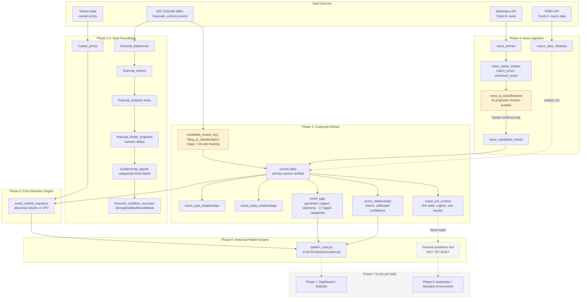

# Stock Research & Market Event Analysis Platform — Project Plan (Revised)

*Rewritten to reflect actual current state. Original plan is preserved in git history for comparison — this version tracks what was actually built, including where deliberate deviations improved on the original design.*

---

## 1. Project Goal (unchanged)

A historical market research platform connecting company financials, news, real-world events, and stock-price movements — allowing calibrated investigation of how markets have historically reacted to similar events.

**Core framing, still accurate:**

```
Company → Financials → News → Events → Stock Price → Analysis
```

**One important refinement over the original doc:** the platform is explicitly *not* trying to predict outcomes. It surfaces historical probabilities with visible sample sizes ("in N comparable cases, X% moved this direction") rather than forecasts. This discipline — avoiding overclaiming — has been a standing, enforced principle throughout, more so than the original plan anticipated.

---

## 2. Core Philosophy: Mechanical Patterns vs. Behavioral Patterns

This distinction is the project's actual thesis, and it's worth stating explicitly rather than leaving implicit.

**Mechanical patterns drift.** The specific relationship between a given event type and a given price reaction — "Fed raises rates 75bp → bank stocks move X%" — depends on market structure, regulatory regime, competitive dynamics, and macro conditions that change over time. A relationship that held in 2006 may not hold the same way in 2026, because the underlying mechanics (how banks are regulated, how rate-sensitive their balance sheets are, who the marginal buyer of bank stock is) have shifted. This is why event-level pattern claims require the n=30–50 threshold, explicit regime-awareness, and calibrated confidence rather than blind trust in historical averages.

**Behavioral patterns are stickier.** Human responses to surprise, fear, herding, overreaction, and narrative-driven decision-making recur across eras with very different market mechanics. Panic-selling on unexpected bad news, herding into already-rising assets, short-term overreaction followed by partial correction, and treating a familiar-sounding narrative ("this is just like 2008") as more informative than it actually is — these are documented behavioral tendencies that show up again and again, specifically because they're about people and cognition rather than the mechanical structure of any particular market era.

**This is what the tag system is actually for.** The `reaction_character` tags (rewarded/punished/muted/diverged_from_fundamentals) and the broader tag governance discipline (cap ~20–30 tags total, require 2–3 real instances before creating a new one) exist to capture the behavioral/psychological layer of market reactions — separate from the mechanical causal-attribution layer. A `causal_attribution` tag says "this event caused this outcome, with this confidence." A `reaction_character` tag says "the market's psychological response to this class of surprise was X" — a claim about human behavior, not market mechanics.

**The practical implication for Phase 8, and for the project generally:** mechanical event→price relationships need continuous revalidation as regimes shift — they are useful today, and their usefulness must be re-earned, not assumed permanent. Behavioral/psychological reaction patterns are the sturdier long-term bet, precisely because the "market" is ultimately made of people, and people's cognitive tendencies under uncertainty are far more stable across decades than any specific market's plumbing. A genuinely reliable eventual "brain" leans more heavily on the behavioral substrate than on any single mechanical relationship, and treats every mechanical pattern as provisional until re-confirmed against current conditions.

---

## 3. What Changed From the Original Plan, and Why

| Original plan | What actually happened | Why it's better |
|---|---|---|
| Alpha Vantage as a candidate data source | Rejected for cost; SEC EDGAR XBRL used as free, authoritative primary source for financials | Free, official, and forces primary-source discipline into the project's DNA from day one |
| "Record meaningful events" (Phase 3) | Every event requires primary-source verification before entry; tracked hit rate via `candidate_review_log` (~20–33% depending on category) | Prevents the event database from silently filling with noise; hit-rate tracking is itself a real data quality signal |
| Single news pipeline (Phase 4) | Split into **Track A** (FRED macro data — structured, backfillable) and **Track B** (Marketaux news — specifically for surprise/consensus framing FRED can't provide) | Recognizes that hard data and *narrative framing* are fundamentally different signals that needed different pipelines |
| Event relationships implied uniform confidence | Explicit confidence calibration (e.g., 0.95 for direct textual confirmation vs. 0.8 for analyst-consensus inference) | Distinguishes confirmed fact from well-supported inference — critical for not overclaiming later |
| Phase 6 pattern example: "12 similar events, 9 positive" | Same idea, but with an enforced n=30–50 threshold before treating any finding as a real pattern, and explicit repeated correction of premature single-instance ("n=1") claims | Real financial-pattern literature is full of spurious small-sample findings; this discipline was underestimated in the original plan |
| Strict linear phase order (finish 2 before starting 3, etc.) | Phases progressed **iteratively and in parallel** | More realistic and more productive than a strict waterfall; phase "boundaries" turned out to be soft |
| No mention of an automated classification layer | Built a full AI-assisted classification pipeline (Haiku-based), used for both Track B news AND Phase 3 8-K filing review, with an explicit **check-and-balance system**: mandatory confidence + reasoning, duplicate detection, random audit sampling, and a human-reviewed queue — nothing auto-promotes to the real `events` table | Wasn't conceived in the original plan at all; emerged from recognizing that pure manual review wouldn't scale, while pure automation couldn't be trusted blind. Proven twice now, at real scale, in two different contexts |
| No explicit "Historical vs. Live" distinction | Introduced as a reframe for Phase 3/4's "never truly finishes" feeling: **Historical** work (bounded, can reach genuine 100%) vs. **Live** work (perpetual, ongoing maintenance) | Gives the team a real sense of completion on bounded sub-problems instead of an undifferentiated, endless backlog |

---

## 4. Current Architecture



*Yellow-highlighted nodes are check-and-balance layers: human review is required before anything reaches the trusted `events` table.*

---

## 5. Phase Status (Current, Honest — updated after the 7-company classifier expansion)

| Phase | Original estimate | Actual status | Notes |
|---|---|---|---|
| 1. Data Foundation | 80% | **~98%** | Fully audited across all 13 tickers via a real completeness scan (not just null-rate). Found and fixed a genuine PLD REIT-revenue-concept gap (2011-2016 now complete). XOM's 2007-2016 quarterly thinness remains a known, tracked, genuinely-hard-to-fix gap — investigated via full XBRL concept scan, appears to require raw instance-document inspection (custom company extension concept), deliberately accepted rather than chased further right now |
| 2. Financial Analysis | 60% | **100%** | Full 11-view chain traced and verified; zero real bugs found in final audit |
| 3. Corporate Events | Early development | **~85%** | Original 6 companies: 63+ events, full 1.01 sweep complete. **All 7 new Tier 1 tickers (LIN, XOM, AEP, PG, GE, PLD, F) now have rich, fully-chained event histories** — hundreds of real events added via a proven AI classification pipeline (`classify_8k_filings.py`), spanning major M&A, leadership successions, litigation, and multi-year sagas across all 13 tracked companies. Tag system expanded from 13 to 17 tags (evidence-based additions) and exhaustively human-reviewed across all categories |
| 4. News Ingestion | Not yet built | **~40%** | Track A (FRED) complete; Track B (Marketaux) built with working AI classification + audit loop. `classify_8k_filings.py` is now a second proven instance of the same check-and-balance architecture, validated at real scale (7 companies, ~2,000+ filings, real classifier misses caught and corrected via random audit and human review) |
| 5. Price Reaction Engine | Not yet built | **~85%** | Abnormal-returns-vs-SPY working; unification with `financial_market_reactions` still pending. Anchor-date diagnostic came back reassuring (small, explainable, consistently-negative drift) |
| 6. Historical Pattern Engine | Future | **~15%** | Tag governance established and exhaustively reviewed. `pattern_card.py` cleared n=30 for the first time this session (rewarded n=52, punished n=54) — but this result is understood to be circular (tags were assigned from the same abnormal-return data being tested), confirming the harness works end-to-end, not that anything is predictive. **New this session: `event_pre_context` layer built** (firm state, market regime, size bucket per event) — the actual pre-event-known feature set a genuine predictive test would need. `surprise_vs_consensus` remains explicitly unbuildable (no analyst estimate data ingested anywhere in the project) |
| 7. Dashboard/Website | Not yet built | **0%** | Untouched — correctly deferred |
| 8. Autotrader ("the brain") | Not yet built | **0%** | Untouched, correctly deferred until Phases 1–7 are genuinely trustworthy. See Section 8 below for the full scoped vision, and the new backtest-environment addendum |

**Two real bugs found and permanently fixed this session, beyond the coverage expansion itself:**
1. `classify_8k_filings.py`'s resumability check silently capped at Supabase's default 1,000-row query limit as the classification table grew past that size — fixed with explicit pagination, benefiting every future classification run regardless of scale.
2. PLD's 2011-2016 quarterly financial gap was traced to two real REIT-specific revenue XBRL concepts (`OperatingLeasesIncomeStatementLeaseRevenue`, `RealEstateRevenueNet`) not in the ingestion candidate list — fixed and re-ingested.
3. (Discovered later, same session) `populate_pre_context.py`'s market-cap lookup used the wrong column name (`close_price` instead of the real `close`) — silently returned NULL for all 337 rows despite reporting success; caught via direct verification query, not by trusting the script's own success message, then fixed and confirmed (335/337 populated correctly).

---

## 6. The Prediction Contract and Evaluation Harness (added after external review)

A trusted outside review of this plan (a day-trading practitioner) identified the project's actual next bottleneck precisely: the n=30–50 sample-size rule protects against calling a small sample a pattern, but does nothing to protect against discovering a pattern and testing it on the same data it was discovered in. Those are different failure modes, and only the first one is currently guarded against.

**No finding may be called a pattern unless it declares all of the following ("the prediction contract"):**
- **Universe** — which companies/sectors it's drawn from, and whether that universe is broad enough to generalize
- **Horizon** — day 0, 0–1, 0–5, 0–21, etc. — not a single unspecified "reaction"
- **Benchmark** — abnormal return vs. SPY and vs. a sector/peer basket
- **Base rate** — what fraction of random, unrelated same-sector days show the same move
- **Similarity keys** — event type is not sufficient; surprise sign/size, firm state, regime, and size/liquidity bucket must all be specified. **As of this session, `event_pre_context` provides firm state, regime, and size bucket for every event — surprise sign remains the one genuinely unbuilt similarity key**, gated on ingesting analyst consensus estimate data (not currently done anywhere in this project)
- **Magnitude and dispersion** — mean/median abnormal return with a confidence interval, not a bare directional percentage
- **Out-of-sample window** — see the walk-forward rule below

**Walk-forward evaluation harness (mandatory before any tag reaches Phase 6 "real pattern" status):**
- Tag definitions are fit/discovered only on data through date T
- The tag is scored only on events after T
- The tag definition is never re-tuned on the evaluation window
- Every candidate pattern is compared against at least two dumb baselines (unconditional firm drift; random events of the same broad type)

**Practical implication:** Phase 6's real deliverable is not a dashboard-ready statistic — it's an evaluation notebook capable of outputting "this tag is not ready (n=11, CI crosses 50%, fails vs. sector baseline)" as readily as a positive finding. That capability is Phase 6; a dashboard on top of it is Phase 7. **`pattern_card.py` exists and correctly reports NOT READY/READY-with-caveats; it does not yet implement the sector benchmark, base rate, or walk-forward split described above — that remains the real, unbuilt Phase 6 deliverable.**

---

## 7. What's Deliberately Deferred (and why that's correct)

- **Live/automated feed**: explicitly deferred until the historical foundation is more complete.
- **"Public Opinion Pull" (sentiment tracking)**: designed but deliberately not built — the `rejected_noise` bucket in `news_candidate_events` is the intended real input, needs the same n=30–50 discipline.
- **Full percentage-based multi-factor attribution model**: needs substantially more tracked companies and mining history.
- **Live automation specifically**: gated not just on Phase 3/4 completeness but on a tag surviving the walk-forward evaluation harness (Section 6) and a costed expected-value test.
- **Phase 8 — Autotrader**: see Sections 6 and 8. Explicitly not started, deliberately gated on Phases 1–7 being genuinely complete.
- **News-sequence chain detection** (Phase 4, well-specified but deferred): Track B's classifier already flags `possible_duplicate_of` against *existing* events. The natural extension — detecting when a *sequence* of incoming news articles over time (initial report → follow-up → resolution) forms a real `event_relationships` chain on its own, auto-suggested rather than built by hand — is not buildable yet because Track B hasn't accumulated enough real article volume to meaningfully test a sequence-detection feature against. Revisit once it has.
- **`surprise_vs_consensus`** (the one missing similarity key in Section 6): requires ingesting analyst estimate/consensus data, a genuinely new data source not currently part of any track. Real, explicitly flagged gap — not silently omitted, not faked with a weaker proxy.

---

## 8. The Full Arc: Phases 1–8, What Each Means, and How They Connect

Each phase exists to make the next phase trustworthy. Skipping ahead — building a flashier phase on top of an unreliable earlier one — just automates unreliability faster. That's the single organizing rule behind the whole project.

**Phase 1 — Data Foundation.** Is the raw data actually correct? Status: ~98% (see Section 5 for the honest asterisk on XOM).

**Phase 2 — Financial Analysis.** Given correct raw data, what does it actually mean? Status: 100%.

**Phase 3 — Corporate Events.** What actually happened, and can we prove it? This phase is the project's evidentiary backbone. Status: ~85%, following the full 7-company classifier expansion this session.

**Phase 4 — News Ingestion.** What was the market told, and how did it frame it? Status: ~40%.

**Phase 5 — Price Reaction Engine.** How did the market actually respond, adjusted for what the whole market was doing anyway? Status: ~85%.

**Phase 6 — Historical Pattern Engine.** Does this actually recur, or does it just look like it does? This is also where the mechanical-vs-behavioral distinction (Section 2) matters most. Status: ~15% — the pre-event context layer (this session) is real progress toward the genuine predictive test, but the walk-forward harness itself remains unbuilt.

**Phase 7 — Dashboard / Website.** Can a human actually see and use any of this? Status: 0%, correctly.

**Phase 8 — Autotrader (the "brain").** Can the system act on its own analysis, safely? The long-term destination: this platform's output becomes the analytical brain driving automated trading decisions. Explicitly not started, and explicitly gated on Phases 1–7 being genuinely, not just approximately, trustworthy.

**When Phase 8 is scoped, it needs its own dedicated planning pass**, including (elaborated this session):

*A historical replay/backtesting environment*, built on the reinforcement-learning "repeat and tweak until it improves" principle (the walking-robot analogy) — but adapted correctly for markets, where there is no physics-engine equivalent to generate synthetic training data. **Critical distinction from naive RL-for-trading (a well-known trap):** this environment must NOT simulate synthetic/fake market behavior — training a bot against a fake simulator just teaches it to beat your own assumptions, not the real market. It must replay REAL historical data (the actual 20+ years across the tracked company universe), where the only thing the environment controls is what information the bot is allowed to see at each point in simulated time.

Required components for that environment:
1. **A forward-moving clock** — steps through real history day-by-day or week-by-week; at each step the bot may only query data timestamped strictly before the current simulated "now," the same look-ahead-prevention discipline already built into `event_pre_context`.
2. **A concrete, scoreable decision per step** — e.g., calibrated odds on a pending event's eventual reaction_character, scored once the real outcome would have actually arrived.
3. **A real scoreboard** — genuine calibration and hit-rate metrics, computed identically every run, with a genuine held-out slice never touched during tuning.
4. **A "speed run of a week" framing** — hide a target week's real data, run the simulation using only prior-knowable information, compare against real results, repeated across many historical weeks.

**Honest scoping caveat:** the tracked universe (13 companies as of this session — described as "anchor nodes" for an eventual much larger universe, not the final scope) has event-driven, not continuous daily, coverage. Many weeks will have zero eligible events for any tracked company. "Hundreds of runs" realistically means sampling across the full ~20-year history already built, not hundreds of distinct information-rich weeks.

Also required, per the original Phase 8 scoping: backtesting against genuinely held-out data, a mandatory paper-trading validation stage, real risk management and position sizing as a separate system from the forecasting engine, a tested kill switch, real broker/execution integration with its own failure modes, and regulatory review appropriate to scale.

**Dependency:** requires the pre-event descriptive context layer (`event_pre_context`, `market_regimes` — built and populated this session) as the actual feature set the bot would use for its decisions, plus the still-missing `surprise_vs_consensus` data.

---

## 9. Coverage Tier System (GICS-Based)

Adopted the real, industry-standard Global Industry Classification Standard (GICS) — 11 sectors, 25 industry groups, 74 industries, 163 sub-industries, maintained by MSCI/S&P Dow Jones Indices.

**Tier 1 — Cross-sector anchors (one per GICS sector, longest public history preferred as tiebreaker). STATUS: all 11 fully onboarded, ingested, AND now have rich event histories as of this session.**

| GICS Sector | Anchor | Status | Notes |
|---|---|---|---|
| Information Technology | MSFT | Onboarded, events built | |
| Health Care | PFE | Onboarded, events built | |
| Financials | JPM | Onboarded, events built | |
| Consumer Discretionary | F (Ford) | **Onboarded, 127 real events built this session** | Largest single haul: historic Mulally hire, Way Forward restructuring, live BlueOval SK battery saga |
| Consumer Staples | PG | **Onboarded, 37 real events built this session** | Gillette ($54B), Coty ($15B), Lafley "boomerang CEO" saga |
| Industrials | GE | **Onboarded, 116 real events built this session** | Richest single history: 2008 Berkshire rescue, Capital Exit Plan, full 3-way split through GE Aerospace rename |
| Energy | XOM | **Onboarded, 41 real events built this session** | Real, tracked, hard-to-fix gap: 2007-2016 quarterly financial thinness, likely a custom XBRL extension concept requiring raw instance-document inspection to fully resolve — deliberately accepted for now |
| Utilities | AEP | **Onboarded, 69 real events built this session** | Turk Plant 15-year saga, Akins installed-then-removed reversal, Icahn activism |
| Materials | LIN | **Onboarded, 12 real events built this session** | Praxair/Linde merger saga, Lamba CEO succession |
| Real Estate | PLD | **Onboarded, 65 real events built this session** | AMB-ProLogis 2011 founding merger; live SEGRO takeover bid as of latest data |
| Communication Services | T (AT&T) | Onboarded (financials/prices only — event history not yet built) | |

**Tier 1.5 — Within-sector comparison set** (existing, not abandoned): AAPL, NVDA, AMD sit in Information Technology alongside MSFT — a deliberate direct-competitor/within-sector comparison set, fully built out already.

**Tier 2/3/4** (future, unchanged from original scoping): large-cap sector-filling → mid-cap → small-cap/recent-IPO, with Tier 4 only ever added when already chained to an existing graph node (a named supplier, competitor, or counterparty in an existing event) — never onboarded cold.

**Important framing note (this session):** the current 13-company universe is explicitly described as **anchor nodes for a future, much larger universe** — not the final intended scope. This has real design implications already accounted for: `market_regimes` is universe-independent by construction (dated by calendar time, not tied to any company), and both AI classification pipelines (`classify_8k_filings.py`, `suggest_event_tags.py`) are already fully ticker-agnostic, so onboarding future companies means running the same proven scripts, not rebuilding anything. One expected future change: `same_industry_comparison` and `cross_entity_ripple` currently have few instances because the universe is deliberately sector-diverse (one anchor per GICS sector) — once more companies are added *within* the same sector, those tags should genuinely fire much more often, which would be the system working correctly, not a signal of anything wrong.

**Immediate remaining Tier 1 work:** build T/AT&T's event history using the now-proven `classify_8k_filings.py` pipeline, the same way the other 7 were done this session.

---

## 10. Immediate Next Steps

1. **Root-cause XOM's quarterly gap properly**, if ever revisited: would require pulling raw XBRL instance documents from individual 10-Q filings (not the aggregated company-facts API), since the standard concept scan found nothing — likely a custom company-specific extension concept from XOM's early XBRL era.
2. **Build T/AT&T's event history** — the one remaining Tier 1 anchor without a built-out event history, using the proven classifier pipeline.
3. **Unify `event_market_reactions` and `financial_market_reactions`'s anchor-date logic** — still pending from the original external review, not yet done.
4. **Build the actual Phase 6 walk-forward evaluation harness** (Section 6) — `pattern_card.py` exists but doesn't yet implement the sector benchmark, base rate comparison, or walk-forward out-of-sample split. This is the real remaining Phase 6 deliverable.
5. **Consider Tier 2 large-cap sector-filling tickers**, or continue deepening the current 13 with T's event history first.
6. **Revisit the news-sequence chain-detection Phase 4 idea** once Track B has accumulated enough real article volume to test against.
7. **The `surprise_vs_consensus` gap** — would require a new data source (analyst estimates) not currently part of any track; flag for a future dedicated scoping session, don't build a weaker silent substitute.

---

## Appendix: News Category Taxonomy (reference)

**Macroeconomic & Monetary Policy News**
- Interest Rates, Inflation Reports, Employment Data, GDP Growth

**Corporate & Industry News**
- Earnings Reports, Mergers & Acquisitions (M&A), Regulatory Changes, Leadership & Operations (CEO changes, layoffs, recalls)

**Global & Unexpected Events**
- Geopolitical Tensions, Natural Disasters, Systemic Shocks (pandemics, banking crises, commodity supply blockades)