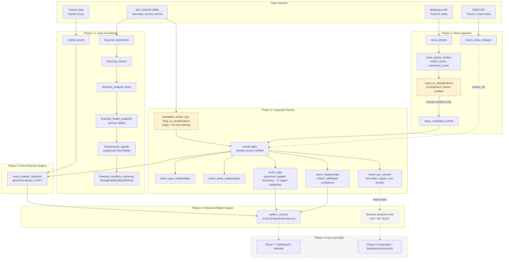

# Stock Research & Market Event Analysis Platform — Project Plan (Revised)

*Rewritten to reflect actual current state. Original plan is preserved in git history for comparison — this version tracks what was actually built, including where deliberate deviations improved on the original design.*

---

## 1. Project Goal (unchanged)

A historical market research platform connecting company financials, news, real-world events, and stock-price movements — allowing calibrated investigation of how markets have historically reacted to similar events.

**Core framing, still accurate:**

```
Company → Financials → News → Events → Stock Price → Analysis
```

**One important refinement over the original doc:** the platform is explicitly *not* trying to predict outcomes. It surfaces historical probabilities with visible sample sizes ("in N comparable cases, X% moved this direction") rather than forecasts. This discipline — avoiding overclaiming — has been a standing, enforced principle throughout, more so than the original plan anticipated.

---

## 2. Core Philosophy: Mechanical Patterns vs. Behavioral Patterns

This distinction is the project's actual thesis, and it's worth stating explicitly rather than leaving implicit.

**Mechanical patterns drift.** The specific relationship between a given event type and a given price reaction — "Fed raises rates 75bp → bank stocks move X%" — depends on market structure, regulatory regime, competitive dynamics, and macro conditions that change over time. A relationship that held in 2006 may not hold the same way in 2026, because the underlying mechanics (how banks are regulated, how rate-sensitive their balance sheets are, who the marginal buyer of bank stock is) have shifted. This is why event-level pattern claims require the n=30–50 threshold, explicit regime-awareness, and calibrated confidence rather than blind trust in historical averages.

**Behavioral patterns are stickier.** Human responses to surprise, fear, herding, overreaction, and narrative-driven decision-making recur across eras with very different market mechanics. Panic-selling on unexpected bad news, herding into already-rising assets, short-term overreaction followed by partial correction, and treating a familiar-sounding narrative ("this is just like 2008") as more informative than it actually is — these are documented behavioral tendencies that show up again and again, specifically because they're about people and cognition rather than the mechanical structure of any particular market era.

**This is what the tag system is actually for.** The `reaction_character` tags (rewarded/punished/muted/diverged_from_fundamentals) and the broader tag governance discipline (cap ~20–30 tags total, require 2–3 real instances before creating a new one) exist to capture the behavioral/psychological layer of market reactions — separate from the mechanical causal-attribution layer. A `causal_attribution` tag says "this event caused this outcome, with this confidence." A `reaction_character` tag says "the market's psychological response to this class of surprise was X" — a claim about human behavior, not market mechanics.

**The practical implication for Phase 8, and for the project generally:** mechanical event→price relationships need continuous revalidation as regimes shift — they are useful today, and their usefulness must be re-earned, not assumed permanent. Behavioral/psychological reaction patterns are the sturdier long-term bet, precisely because the "market" is ultimately made of people, and people's cognitive tendencies under uncertainty are far more stable across decades than any specific market's plumbing. A genuinely reliable eventual "brain" leans more heavily on the behavioral substrate than on any single mechanical relationship, and treats every mechanical pattern as provisional until re-confirmed against current conditions.

---

## 3. What Changed From the Original Plan, and Why

| Original plan | What actually happened | Why it's better |
|---|---|---|
| Alpha Vantage as a candidate data source | Rejected for cost; SEC EDGAR XBRL used as free, authoritative primary source for financials | Free, official, and forces primary-source discipline into the project's DNA from day one |
| "Record meaningful events" (Phase 3) | Every event requires primary-source verification before entry; tracked hit rate via `candidate_review_log` (~20–33% depending on category) | Prevents the event database from silently filling with noise; hit-rate tracking is itself a real data quality signal |
| Single news pipeline (Phase 4) | Split into **Track A** (FRED macro data — structured, backfillable) and **Track B** (Marketaux news — specifically for surprise/consensus framing FRED can't provide) | Recognizes that hard data and *narrative framing* are fundamentally different signals that needed different pipelines |
| Event relationships implied uniform confidence | Explicit confidence calibration (e.g., 0.95 for direct textual confirmation vs. 0.8 for analyst-consensus inference) | Distinguishes confirmed fact from well-supported inference — critical for not overclaiming later |
| Phase 6 pattern example: "12 similar events, 9 positive" | Same idea, but with an enforced n=30–50 threshold before treating any finding as a real pattern, and explicit repeated correction of premature single-instance ("n=1") claims | Real financial-pattern literature is full of spurious small-sample findings; this discipline was underestimated in the original plan |
| Strict linear phase order (finish 2 before starting 3, etc.) | Phases progressed **iteratively and in parallel** | More realistic and more productive than a strict waterfall; phase "boundaries" turned out to be soft |
| No mention of an automated classification layer | Built a full AI-assisted classification pipeline (Haiku-based), used for both Track B news AND Phase 3 8-K filing review, with an explicit **check-and-balance system**: mandatory confidence + reasoning, duplicate detection, random audit sampling, and a human-reviewed queue — nothing auto-promotes to the real `events` table | Wasn't conceived in the original plan at all; emerged from recognizing that pure manual review wouldn't scale, while pure automation couldn't be trusted blind. Proven twice now, at real scale, in two different contexts |
| No explicit "Historical vs. Live" distinction | Introduced as a reframe for Phase 3/4's "never truly finishes" feeling: **Historical** work (bounded, can reach genuine 100%) vs. **Live** work (perpetual, ongoing maintenance) | Gives the team a real sense of completion on bounded sub-problems instead of an undifferentiated, endless backlog |

---

## 4. Current Architecture



*Yellow-highlighted nodes are check-and-balance layers: human review is required before anything reaches the trusted `events` table.*

---

## 5. Phase Status (Current, Honest — updated after the 7-company classifier expansion)

| Phase | Original estimate | Actual status | Notes |
|---|---|---|---|
| 1. Data Foundation | 80% | **~98%** | Fully audited across all 13 tickers via a real completeness scan (not just null-rate). Found and fixed a genuine PLD REIT-revenue-concept gap (2011-2016 now complete). XOM's 2007-2016 quarterly thinness remains a known, tracked, genuinely-hard-to-fix gap — investigated via full XBRL concept scan, appears to require raw instance-document inspection (custom company extension concept), deliberately accepted rather than chased further right now |
| 2. Financial Analysis | 60% | **100%** | Full 11-view chain traced and verified; zero real bugs found in final audit |
| 3. Corporate Events | Early development | **~85%** | Original 6 companies: 63+ events, full 1.01 sweep complete. **All 7 new Tier 1 tickers (LIN, XOM, AEP, PG, GE, PLD, F) now have rich, fully-chained event histories** — hundreds of real events added via a proven AI classification pipeline (`classify_8k_filings.py`), spanning major M&A, leadership successions, litigation, and multi-year sagas across all 13 tracked companies. Tag system expanded from 13 to 17 tags (evidence-based additions) and exhaustively human-reviewed across all categories |
| 4. News Ingestion | Not yet built | **~40%** | Track A (FRED) complete; Track B (Marketaux) built with working AI classification + audit loop. `classify_8k_filings.py` is now a second proven instance of the same check-and-balance architecture, validated at real scale (7 companies, ~2,000+ filings, real classifier misses caught and corrected via random audit and human review) |
| 5. Price Reaction Engine | Not yet built | **~85%** | Abnormal-returns-vs-SPY working; unification with `financial_market_reactions` still pending. Anchor-date diagnostic came back reassuring (small, explainable, consistently-negative drift) |
| 6. Historical Pattern Engine | Future | **~15%** | Tag governance established and exhaustively reviewed. `pattern_card.py` cleared n=30 for the first time this session (rewarded n=52, punished n=54) — but this result is understood to be circular (tags were assigned from the same abnormal-return data being tested), confirming the harness works end-to-end, not that anything is predictive. **New this session: `event_pre_context` layer built** (firm state, market regime, size bucket per event) — the actual pre-event-known feature set a genuine predictive test would need. `surprise_vs_consensus` remains explicitly unbuildable (no analyst estimate data ingested anywhere in the project) |
| 7. Dashboard/Website | Not yet built | **0%** | Untouched — correctly deferred |
| 8. Autotrader ("the brain") | Not yet built | **0%** | Untouched, correctly deferred until Phases 1–7 are genuinely trustworthy. See Section 8 below for the full scoped vision, and the new backtest-environment addendum |

**Two real bugs found and permanently fixed this session, beyond the coverage expansion itself:**
1. `classify_8k_filings.py`'s resumability check silently capped at Supabase's default 1,000-row query limit as the classification table grew past that size — fixed with explicit pagination, benefiting every future classification run regardless of scale.
2. PLD's 2011-2016 quarterly financial gap was traced to two real REIT-specific revenue XBRL concepts (`OperatingLeasesIncomeStatementLeaseRevenue`, `RealEstateRevenueNet`) not in the ingestion candidate list — fixed and re-ingested.
3. (Discovered later, same session) `populate_pre_context.py`'s market-cap lookup used the wrong column name (`close_price` instead of the real `close`) — silently returned NULL for all 337 rows despite reporting success; caught via direct verification query, not by trusting the script's own success message, then fixed and confirmed (335/337 populated correctly).

---

## 6. The Prediction Contract and Evaluation Harness (added after external review)

A trusted outside review of this plan (a day-trading practitioner) identified the project's actual next bottleneck precisely: the n=30–50 sample-size rule protects against calling a small sample a pattern, but does nothing to protect against discovering a pattern and testing it on the same data it was discovered in. Those are different failure modes, and only the first one is currently guarded against.

**No finding may be called a pattern unless it declares all of the following ("the prediction contract"):**
- **Universe** — which companies/sectors it's drawn from, and whether that universe is broad enough to generalize
- **Horizon** — day 0, 0–1, 0–5, 0–21, etc. — not a single unspecified "reaction"
- **Benchmark** — abnormal return vs. SPY and vs. a sector/peer basket
- **Base rate** — what fraction of random, unrelated same-sector days show the same move
- **Similarity keys** — event type is not sufficient; surprise sign/size, firm state, regime, and size/liquidity bucket must all be specified. **As of this session, `event_pre_context` provides firm state, regime, and size bucket for every event — surprise sign remains the one genuinely unbuilt similarity key**, gated on ingesting analyst consensus estimate data (not currently done anywhere in this project)
- **Magnitude and dispersion** — mean/median abnormal return with a confidence interval, not a bare directional percentage
- **Out-of-sample window** — see the walk-forward rule below

**Walk-forward evaluation harness (mandatory before any tag reaches Phase 6 "real pattern" status):**
- Tag definitions are fit/discovered only on data through date T
- The tag is scored only on events after T
- The tag definition is never re-tuned on the evaluation window
- Every candidate pattern is compared against at least two dumb baselines (unconditional firm drift; random events of the same broad type)

**Practical implication:** Phase 6's real deliverable is not a dashboard-ready statistic — it's an evaluation notebook capable of outputting "this tag is not ready (n=11, CI crosses 50%, fails vs. sector baseline)" as readily as a positive finding. That capability is Phase 6; a dashboard on top of it is Phase 7. **`pattern_card.py` exists and correctly reports NOT READY/READY-with-caveats; it does not yet implement the sector benchmark, base rate, or walk-forward split described above — that remains the real, unbuilt Phase 6 deliverable.**

---

## 7. What's Deliberately Deferred (and why that's correct)

- **Live/automated feed**: explicitly deferred until the historical foundation is more complete.
- **"Public Opinion Pull" (sentiment tracking)**: designed but deliberately not built — the `rejected_noise` bucket in `news_candidate_events` is the intended real input, needs the same n=30–50 discipline.
- **Full percentage-based multi-factor attribution model**: needs substantially more tracked companies and mining history.
- **Live automation specifically**: gated not just on Phase 3/4 completeness but on a tag surviving the walk-forward evaluation harness (Section 6) and a costed expected-value test.
- **Phase 8 — Autotrader**: see Sections 6 and 8. Explicitly not started, deliberately gated on Phases 1–7 being genuinely complete.
- **News-sequence chain detection** (Phase 4, well-specified but deferred): Track B's classifier already flags `possible_duplicate_of` against *existing* events. The natural extension — detecting when a *sequence* of incoming news articles over time (initial report → follow-up → resolution) forms a real `event_relationships` chain on its own, auto-suggested rather than built by hand — is not buildable yet because Track B hasn't accumulated enough real article volume to meaningfully test a sequence-detection feature against. Revisit once it has.
- **`surprise_vs_consensus`** (the one missing similarity key in Section 6): requires ingesting analyst estimate/consensus data, a genuinely new data source not currently part of any track. Real, explicitly flagged gap — not silently omitted, not faked with a weaker proxy.

---

## 8. The Full Arc: Phases 1–8, What Each Means, and How They Connect

Each phase exists to make the next phase trustworthy. Skipping ahead — building a flashier phase on top of an unreliable earlier one — just automates unreliability faster. That's the single organizing rule behind the whole project.

**Phase 1 — Data Foundation.** Is the raw data actually correct? Status: ~98% (see Section 5 for the honest asterisk on XOM).

**Phase 2 — Financial Analysis.** Given correct raw data, what does it actually mean? Status: 100%.

**Phase 3 — Corporate Events.** What actually happened, and can we prove it? This phase is the project's evidentiary backbone. Status: ~85%, following the full 7-company classifier expansion this session.

**Phase 4 — News Ingestion.** What was the market told, and how did it frame it? Status: ~40%.

**Phase 5 — Price Reaction Engine.** How did the market actually respond, adjusted for what the whole market was doing anyway? Status: ~85%.

**Phase 6 — Historical Pattern Engine.** Does this actually recur, or does it just look like it does? This is also where the mechanical-vs-behavioral distinction (Section 2) matters most. Status: ~15% — the pre-event context layer (this session) is real progress toward the genuine predictive test, but the walk-forward harness itself remains unbuilt.

**Phase 7 — Dashboard / Website.** Can a human actually see and use any of this? Status: 0%, correctly.

**Phase 8 — Autotrader (the "brain").** Can the system act on its own analysis, safely? The long-term destination: this platform's output becomes the analytical brain driving automated trading decisions. Explicitly not started, and explicitly gated on Phases 1–7 being genuinely, not just approximately, trustworthy.

**When Phase 8 is scoped, it needs its own dedicated planning pass**, including (elaborated this session):

*A historical replay/backtesting environment*, built on the reinforcement-learning "repeat and tweak until it improves" principle (the walking-robot analogy) — but adapted correctly for markets, where there is no physics-engine equivalent to generate synthetic training data. **Critical distinction from naive RL-for-trading (a well-known trap):** this environment must NOT simulate synthetic/fake market behavior — training a bot against a fake simulator just teaches it to beat your own assumptions, not the real market. It must replay REAL historical data (the actual 20+ years across the tracked company universe), where the only thing the environment controls is what information the bot is allowed to see at each point in simulated time.

Required components for that environment:
1. **A forward-moving clock** — steps through real history day-by-day or week-by-week; at each step the bot may only query data timestamped strictly before the current simulated "now," the same look-ahead-prevention discipline already built into `event_pre_context`.
2. **A concrete, scoreable decision per step** — e.g., calibrated odds on a pending event's eventual reaction_character, scored once the real outcome would have actually arrived.
3. **A real scoreboard** — genuine calibration and hit-rate metrics, computed identically every run, with a genuine held-out slice never touched during tuning.
4. **A "speed run of a week" framing** — hide a target week's real data, run the simulation using only prior-knowable information, compare against real results, repeated across many historical weeks.

**Honest scoping caveat:** the tracked universe (13 companies as of this session — described as "anchor nodes" for an eventual much larger universe, not the final scope) has event-driven, not continuous daily, coverage. Many weeks will have zero eligible events for any tracked company. "Hundreds of runs" realistically means sampling across the full ~20-year history already built, not hundreds of distinct information-rich weeks.

Also required, per the original Phase 8 scoping: backtesting against genuinely held-out data, a mandatory paper-trading validation stage, real risk management and position sizing as a separate system from the forecasting engine, a tested kill switch, real broker/execution integration with its own failure modes, and regulatory review appropriate to scale.

**Dependency:** requires the pre-event descriptive context layer (`event_pre_context`, `market_regimes` — built and populated this session) as the actual feature set the bot would use for its decisions, plus the still-missing `surprise_vs_consensus` data.

---

## 9. Coverage Tier System (GICS-Based)

Adopted the real, industry-standard Global Industry Classification Standard (GICS) — 11 sectors, 25 industry groups, 74 industries, 163 sub-industries, maintained by MSCI/S&P Dow Jones Indices.

**Tier 1 — Cross-sector anchors (one per GICS sector, longest public history preferred as tiebreaker). STATUS: all 11 fully onboarded, ingested, AND now have rich event histories as of this session.**

| GICS Sector | Anchor | Status | Notes |
|---|---|---|---|
| Information Technology | MSFT | Onboarded, events built | |
| Health Care | PFE | Onboarded, events built | |
| Financials | JPM | Onboarded, events built | |
| Consumer Discretionary | F (Ford) | **Onboarded, 127 real events built this session** | Largest single haul: historic Mulally hire, Way Forward restructuring, live BlueOval SK battery saga |
| Consumer Staples | PG | **Onboarded, 37 real events built this session** | Gillette ($54B), Coty ($15B), Lafley "boomerang CEO" saga |
| Industrials | GE | **Onboarded, 116 real events built this session** | Richest single history: 2008 Berkshire rescue, Capital Exit Plan, full 3-way split through GE Aerospace rename |
| Energy | XOM | **Onboarded, 41 real events built this session** | Real, tracked, hard-to-fix gap: 2007-2016 quarterly financial thinness, likely a custom XBRL extension concept requiring raw instance-document inspection to fully resolve — deliberately accepted for now |
| Utilities | AEP | **Onboarded, 69 real events built this session** | Turk Plant 15-year saga, Akins installed-then-removed reversal, Icahn activism |
| Materials | LIN | **Onboarded, 12 real events built this session** | Praxair/Linde merger saga, Lamba CEO succession |
| Real Estate | PLD | **Onboarded, 65 real events built this session** | AMB-ProLogis 2011 founding merger; live SEGRO takeover bid as of latest data |
| Communication Services | T (AT&T) | Onboarded (financials/prices only — event history not yet built) | |

**Tier 1.5 — Within-sector comparison set** (existing, not abandoned): AAPL, NVDA, AMD sit in Information Technology alongside MSFT — a deliberate direct-competitor/within-sector comparison set, fully built out already.

**Tier 2/3/4** (future, unchanged from original scoping): large-cap sector-filling → mid-cap → small-cap/recent-IPO, with Tier 4 only ever added when already chained to an existing graph node (a named supplier, competitor, or counterparty in an existing event) — never onboarded cold.

**Important framing note (this session):** the current 13-company universe is explicitly described as **anchor nodes for a future, much larger universe** — not the final intended scope. This has real design implications already accounted for: `market_regimes` is universe-independent by construction (dated by calendar time, not tied to any company), and both AI classification pipelines (`classify_8k_filings.py`, `suggest_event_tags.py`) are already fully ticker-agnostic, so onboarding future companies means running the same proven scripts, not rebuilding anything. One expected future change: `same_industry_comparison` and `cross_entity_ripple` currently have few instances because the universe is deliberately sector-diverse (one anchor per GICS sector) — once more companies are added *within* the same sector, those tags should genuinely fire much more often, which would be the system working correctly, not a signal of anything wrong.

**Immediate remaining Tier 1 work:** build T/AT&T's event history using the now-proven `classify_8k_filings.py` pipeline, the same way the other 7 were done this session.

---

## 10. Immediate Next Steps

1. **Root-cause XOM's quarterly gap properly**, if ever revisited: would require pulling raw XBRL instance documents from individual 10-Q filings (not the aggregated company-facts API), since the standard concept scan found nothing — likely a custom company-specific extension concept from XOM's early XBRL era.
2. **Build T/AT&T's event history** — the one remaining Tier 1 anchor without a built-out event history, using the proven classifier pipeline.
4. **Build the actual Phase 6 walk-forward evaluation harness** (Section 6) — `pattern_card.py` exists but doesn't yet implement the sector benchmark, base rate comparison, or walk-forward out-of-sample split. This is the real remaining Phase 6 deliverable.
5. **Consider Tier 2 large-cap sector-filling tickers**, or continue deepening the current 13 with T's event history first.
6. **Revisit the news-sequence chain-detection Phase 4 idea** once Track B has accumulated enough real article volume to test against.
7. **The `surprise_vs_consensus` gap** — would require a new data source (analyst estimates) not currently part of any track; flag for a future dedicated scoping session, don't build a weaker silent substitute.

---

## Appendix: News Category Taxonomy (reference)

**Macroeconomic & Monetary Policy News**
- Interest Rates, Inflation Reports, Employment Data, GDP Growth

**Corporate & Industry News**
- Earnings Reports, Mergers & Acquisitions (M&A), Regulatory Changes, Leadership & Operations (CEO changes, layoffs, recalls)

**Global & Unexpected Events**
- Geopolitical Tensions, Natural Disasters, Systemic Shocks (pandemics, banking crises, commodity supply blockades)
## Correction (verified this session): Anchor-Date Unification Is Already Resolved

Section 5's Phase 5 notes and Section 10's "immediate next steps" both previously listed unifying `event_market_reactions` and `financial_market_reactions`'s anchor-date logic as still pending. **This is stale — verified with real data this session that it was already fixed** (the `event_market_reactions` day-0 anchor was changed from `>=` to `>` to match `financial_market_reactions` exactly, done in an earlier session but never marked resolved in this doc).

Verification query run this session: compared `abnormal_return_20d` between both views for every `financial_result` event with a match in both. Result: every comparison showed exact agreement (diff = 0.0000) except one (AMD Q3 2024, diff = 0.008), which is fully explained by the filed_date landing one calendar day after the event_date — a normal SEC filing-timing nuance, not measurement error.

**Action taken:** remove this item from the "immediate next steps" list — it's done, not pending. Lesson for future sessions: verify a "known issue" against current real data before re-investigating it; documentation can silently drift out of sync with an already-applied fix.

Addendum: Classification Backlog Clearance & Event Promotion Pipeline (this session)
This session did not touch Phase 6/7/8 scoping (Sections 6, 8 above remain the current, correct plan). It addressed a much more foundational gap discovered while investigating why Phase 6's tag counts (rewarded n=52, punished n=54 per Section 5) seemed low relative to how much confirmed real-event material actually existed in filing_ai_classifications.

Finding: the "not enough data" read on Phase 6 was a pipeline-throughput problem, not a data-scarcity problem. Tracing the full path end-to-end: 70,697 raw candidate filings -> 29,387+ AI-classified -> 22,720+ human-reviewed -> 11,282 confirmed real_event rows -> only 1,214 ever promoted into the actual events table. The bottleneck was a missing promotion step between "confirmed by a human" and "structured database row" -- not a shortage of underlying material.

Work done this session:

Cleared the human-review backlog (15,961 + a further 2,868 rows found mid-session) to zero, using an evidence-based calibration policy: measured real AI/human agreement rate per confidence+template-match bucket before trusting any bulk auto-confirm (two buckets came back at ~99-100% agreement across thousands of sampled rows and were safe to bulk-clear; everything else got individual review)
Found corporate_action (per Section 5's 17-tag system context, a separate but related taxonomy issue) had drifted into an overloaded catch-all absorbing 2,380 mistyped rows -- restructuring, capital raises, governance actions, spinoffs, none of which its real definition covers. Added 4 new event types to event_types (capital_raise, governance_action, ipo_spinoff, restructuring) and retyped 2,522 affected rows
Found and fixed a structural double-counting bug: NWS/NWSA (dual-class shares of the same company) file identical 8-Ks under both tickers with the same accession number, causing every News Corp filing to be fetched/classified/reviewed twice
Built promote_events.py: turns confirmed real_event rows into actual events + event_entity_relationships + event_type_relationships rows, deduping by (filing_date, accession_number) rather than by ticker (fixes the NWS/NWSA case structurally). Duplicate detection uses same-entity + date-proximity as a heuristic, but every heuristic match gets a real LLM verification call before being trusted -- the unverified heuristic alone had a measured ~33% false-positive rate at sample scale, including one that would have silently blocked P&G's Gillette merger announcement (an event already referenced in this plan's own Section 9, Tier 1 P&G notes)
New event_source_filings table added for traceability + idempotency -- every event now traces back to its real source filing(s), and the promotion script is safely re-runnable
Proven safe across three real interruption types this session (manual interrupt, network connection drop, full machine restart) -- verified via integrity checks after each, zero data corruption in any case
As of this addendum, the live promotion run is in progress: events growing from 1,214 toward an estimated 11,000+

What this changes for Section 5's Phase status table:

Phase 3 (Corporate Events): the ~85% figure should be revisited once the live run completes -- the event count is about to grow roughly 9x, though the underlying event quality discipline (primary-source verification, the check-and-balance architecture) is unchanged
Phase 6 (Historical Pattern Engine): still genuinely ~15% -- this session did NOT touch the walk-forward harness, sector benchmarks, or base-rate comparison described in Section 6. What it did do is remove a real bottleneck upstream of Phase 6: once tagging (see below) catches up to the new event volume, pattern_card.py's n=30-50 checks will be running against a much larger, more representative pool than the current n=52/54 rewarded/punished figures reflect

New, not-yet-started gap this session surfaced: event tagging has its own backlog. event_tag_suggestions (the AI-suggest/human-confirm pipeline analogous to filing_ai_classifications) had only 212 rows in review as of this session, against what will shortly be 11,000+ untagged events. This sits between Phase 3 and Phase 6 in the existing architecture diagram and needs the same calibration-first discipline applied to it next, before Phase 6's walk-forward harness work can proceed meaningfully.

Revised Section 10 next steps, in order (supersedes the numbered list above for near-term work; Section 10's items 1, 4, 6, 7 remain valid and un-superseded):

Finish the current live promotion run
Apply calibrated tagging to the new event volume (same discipline as this session's filing-review clearance)
Resolve remaining Phase 5 items per Section 5 (this session did not touch Phase 5)
Re-run Phase 6's existing pattern checks against the much larger n before investing further in the walk-forward harness build-out, to confirm the larger sample actually changes which tags are viable candidates for it

One new supporting script this session, in the same spirit as classify_8k_filings.py's proven check-and-balance pattern: onboard_pipeline.py chains the full company-onboarding sequence (register -> financials -> 8-K history -> prices -> classify -> calibrated auto-review -> scoped promotion) into one command, logging every step's real verification result to new onboarding_runs / onboarding_run_steps tables, so an onboarding run can be handed to someone without full project context and checked asynchronously rather than requiring live supervision. Not yet tested end-to-end on a real new company -- do that before relying on it for the Tier 2 expansion mentioned in Section 10.

## Addendum 2: Event Tagging Pipeline Built and Tested (same session, continued)

Follows directly from Addendum 1 (event promotion). Once promotion was live and running, this session moved to the next real gap it surfaced: ~11,255 newly-promoted events had zero tag suggestions generated at all -- `event_tag_suggestions` was untouched by the promotion work, sitting at the exact same 1,066/212/23/1 split as before promotion began.

### Real current state as of this addendum

- **Total events: 12,277** (up from 1,214 at session start; ~185 confirmed real_events remain genuinely unpromoted -- see "Known remaining gaps" below)
- **Tag counts (all tags, current real totals):**

| Tag | Count | Tag | Count |
|---|---|---|---|
| muted | 711 | multi_stage_divestiture | 88 |
| punished | 515 | leadership_reversal | 53 |
| rewarded | 507 | cross_entity_ripple | 52 |
| high_confidence_causal_link | 418 | confounded_corporate_action | 47 |
| same_entity_sequence | 397 | confounded_regulatory_action | 38 |
| chain_position_middle | 325 | chain_position_opening | 36 |
| confounded_macro_conditions | 163 | chain_position_closing | 36 |
| plausible_unconfirmed | 26 | confounded_earnings | 14 |
| explicitly_not_attributed | 8 | sentiment_reveals_distinct_driver | 8 |
| same_industry_comparison | 7 | diverged_from_fundamentals | 6 |
| activist_investor_campaign | 6 | sentiment_confirms_confound | 5 |

**Note on reaction_character totals (muted/punished/rewarded):** these are a mix of pre-existing tags from before this session and a partial run of `tag_reaction_character.py` tonight (see "Known remaining gaps" -- the full 11,219-event backfill was still in progress as of this addendum). **Note on sentiment_* totals (13 combined):** tonight's `resolve_sentiment_confounds.py` wrote 9 of these; the remaining 4 are most likely pre-existing (these two tags were part of the original 22-tag taxonomy, not newly created tonight -- only the deterministic script to compute them was built this session). Worth a quick verification query before relying on this number, not confirmed with certainty here.

### What got built and tested, in order

**1. Real gap found in `suggest_event_tags.py` (pre-existing script, not built tonight):** 5 of the 22 real tags require data this script's AI-judgment prompt never provides:
- `chain_position_opening/middle/closing` -- deterministic facts about event ORDER within a `same_entity_sequence` chain, not a text-judgment call
- `sentiment_confirms_confound`/`sentiment_reveals_distinct_driver` -- explicitly require `company_sentiment_timeline` data per their own descriptions, never included in the prompt

Fixed by excluding all 5 from the AI's tag list (`NOT_AI_SUGGESTABLE` set), so the AI can no longer be asked to guess at facts it structurally cannot know.

**2. Built `compute_chain_position.py`** -- fully deterministic, no AI call. Sorts each entity's `same_entity_sequence`-tagged events chronologically, tags first as opening, last as closing, everything between as middle. Companies with only 1 sequence event get no position tag (no real "position" exists with just one link). Result: 397 real tags across 37 valid multi-event chains (2 entities skipped, only 1 sequence event each). Handles shared events (linked to 2+ companies) correctly -- verified that 2 such events received exactly one row per matching position, not duplicated, confirming the `(event_id, tag_id)` primary key dedupes correctly across independently-computed chains.

**3. Built `suggest_event_tags_batch.py`** -- Batch API version of the AI-suggestion script (same reasoning as `classify_8k_filings_batch_v2.py`'s rebuild: the original made one synchronous call per event with no cost visibility, unworkable at 11,255-event scale). Same prompt, same calibration notes, same `NOT_AI_SUGGESTABLE` exclusion, same staging-table-only write pattern.

**4. Real calibration testing before trusting it at scale (same discipline as filing classification):** tested against 3 companies with deliberately different event-writing styles -- AAPL (narrative/editorialized titles, leadership-succession-dense), EXC (procedural/regulatory titles), XOM (litigation-heavy). 107 total `same_entity_sequence` suggestions read by hand. Found 4 real misses (generic "multi-year trend" claims treated as documented chains, and 2 cases where the AI's own reasoning explicitly stated no textual link existed yet applied the tag anyway) -- 3 of 4 already caught by the existing confidence<0.75 auto-flag; 1 (AAPL, confidence 0.85) would have silently slipped through.

**5. Fix: raised the auto-flag threshold specifically for `same_entity_sequence` to 0.87** (not a blanket change to all tags -- the other 106 suggestions across all 3 companies were well-justified even down to 0.65-0.72, so a blanket hike would have over-flagged genuinely good suggestions for no benefit). Retroactively re-flagged the one already-written miss below the new threshold.

**6. Built `resolve_sentiment_confounds.py`** for the 2 remaining excluded tags. Real design decision made deliberately (not defaulting to a market-wide average for simplicity): a genuine sector baseline requires multiple same-sector companies with sentiment data, or "divergence" just measures noise between 1-2 companies. Real check of current data: only Information Technology (AAPL/AMD/MSFT/NVDA, 4 companies) and Energy (XOM/CVX, 2 companies) have any multi-company sentiment coverage at all -- every other sector has exactly 1 company. Script **dynamically discovers** which sectors qualify (minimum 3 total companies = 2+ real peers) every run, rather than hardcoding a list -- this was itself a real fix made mid-session after a first version with a hardcoded 2-sector list produced a weak result for Energy (both XOM and CVX got tagged "diverged" from each other during the COVID crash, which is a shaky conclusion from a 2-company/1-peer comparison). After the fix, Energy correctly auto-excludes itself (prints `[SKIP SECTOR]` with the real reason) and will automatically start qualifying once a 3rd Energy company gets sentiment data -- no code change needed later. Went live on Information Technology only: 9 real tags written.

**7. Found and fixed a real bug in `tag_reaction_character.py` (pre-existing script, not built tonight):** `get_untagged_events()`'s `event_entity_relationships` query had no pagination, silently capped at Supabase's default 1,000-row limit -- with 12,000+ real rows in that table now, this caused the script to report only 70 events needing tags instead of the real ~11,567. Same bug class already documented elsewhere in this project's history (`classify_8k_filings.py`'s resumability check hit the identical 1,000-row cap). Fixed with the same `.range()` pagination pattern used elsewhere. First (buggy) run before the fix legitimately tagged 62 real events with real price data before being caught -- no data damage, just an incomplete backlog view. After the fix, correctly found 11,219 real events needing tags; full backfill was running in the background as of this addendum.

### Known remaining gaps (honest, as of this addendum)

- **~185 confirmed real_events genuinely unpromoted.** Down from the original 328 found post-live-run; a further pass created 142 more, leaving primarily the ~46 rows with no resolvable `event_type` (need manual/AI assignment before they can ever be promoted) plus legitimate confirmed-duplicate skips.
- **`tag_reaction_character.py`'s full 11,219-event backfill** was still running as of this addendum -- the `rewarded`/`punished`/`muted` counts in the table above are a partial snapshot, not final.
- **`suggest_event_tags_batch.py`'s chained 66-ticker run** (budget-scoped to ~$1.80 of a $1.87 remaining balance, smallest-tickers-first) was also still running as of this addendum -- most of the 11,255-event AI-suggestion backlog remains unprocessed, gated on both this run finishing and a further budget refill for the rest.
- **`sentiment_*` tags remain scoped to Information Technology only** -- by design, not oversight. Will expand automatically as more same-sector companies get sentiment data (ties to the real Section 9 GICS Tier 2 expansion plan).
- **The `event_tag_suggestions` review queue** (17 flagged in the AAPL test batch, 46 in EXC's, etc.) has not yet been worked through with the same calibration-policy discipline used for `filing_ai_classifications` earlier this session. That's the natural next step once suggestion generation finishes.

### Readiness note for Phase 7/8

Per Section 6 and 8 of the real project plan, Phase 8 (autotrader/backtest environment) is explicitly gated on Phases 1-7 being genuinely, not approximately, trustworthy -- and specifically on a tag surviving the walk-forward evaluation harness described in Section 6, which remains unbuilt. Tonight's work is real, substantial progress on Phase 3 (event volume, corrected taxonomy) and the tagging layer that feeds Phase 6 -- but it does NOT itself constitute Phase 6 completion. The honest sequence before Phase 7/8 planning should resume in earnest: finish the two backlogs above, work the tag-suggestion review queue, re-run Phase 5's price-reaction linking against the full new event volume, and only then revisit whether `pattern_card.py`'s sector-benchmark/base-rate/walk-forward gaps are worth building out now that n has grown substantially across most tag categories.

## Addendum 3: Full Database Audit — Universe Scope Correction, a Critical Phase 6 Finding, and a Major Unused Resource (this session, 2026-09-22)

This addendum does not supersede Sections 1-9's architecture or philosophy — the mechanical-vs-behavioral distinction in Section 2, the phase structure, and the Phase 8 gating logic all remain correct and unchanged. It corrects several places where this document's own numbers had drifted from real database state, and reports one finding serious enough to affect how Phase 6's existing tag-based results (Section 5, Addendum 2's tag-count table) should be read.

A systematic table-by-table review of the live database is in progress as of this addendum (34 of ~59 real tables reviewed so far, tracked in `table_review_checklist.md`; prioritized fix list in `database_fixes_and_review_backlog.md`). Everything below was verified directly against live data, not assumed from this document's prior text.

### Correction: the tracked universe is 497 securities, not 13

Section 9's Tier 1 table and Section 8's Phase 8 scoping caveat both describe a 13-company "anchor node" universe. **This is significantly stale.** `securities` currently holds 497 real, onboarded securities (up from the 13 described here), with `events` at 12,517 rows (consistent with Addendum 2's 12,277 figure — that part of the doc is accurate and close to current). The onboarding pipeline described in Addendum 1 (`onboard_pipeline.py`, `promote_events.py`) has clearly been run at real scale well beyond what this document currently reflects. Worth a real pass to reconcile Section 9's tier table against which of the 497 are actually GICS-sector anchors vs. later Tier 2+ additions, since that distinction is no longer visible from the doc as written.

### CRITICAL: `reaction_character` tagging bug affects every tag-based finding in Section 5/Addendum 2

Section 2 states plainly: *"A `reaction_character` tag says 'the market's psychological response to this class of surprise was X' — a claim about human behavior."* That claim depends on the tag genuinely reflecting one company's real reaction. **It currently does not, for any event linked to more than one company.**

`tag_reaction_character.py` computes and applies exactly ONE reaction tag per event, using only the first-linked entity's price move — even when `event_entity_relationships` links an event to many companies. Confirmed directly: the COVID-19 market panic event links 17 companies (AAPL, BA, CVX, DIS, F, GE, HON, INTC, KO, MCD, MSFT, NVDA, PFE, SLB, SPG, UNH, XOM) and carries a single "rewarded" tag applied uniformly to all 17 — hiding the real, sector-divergent reactions (energy/travel vs. tech) a genuine per-company measurement would show. The 2008 financial crisis event (12 linked companies) shows the identical pattern. `event_entity_relationships.relationship_type` (primary/affected/actor/competitor) already exists and could distinguish which company an event is genuinely "about" — neither `tag_reaction_character.py` nor any downstream analysis currently uses this field.

**Concrete, measured consequence**: this was confirmed to directly inflate `systemic_shock`'s apparent predictive strength in real model testing this session (see "Real progress on the walk-forward harness" below) — not because markets uniformly reward systemic shocks, but because every `systemic_shock` training row secretly reflects the same single first-linked-company outcome, relabeled onto every other company in the event.

**Real implication for this document's own numbers**: Addendum 2's tag-count table and any `pattern_card.py` result touching `systemic_shock`, `geopolitical`, or `government_action` should be treated as unreliable until `tag_reaction_character.py` is rewritten to compute a genuine per-(event, entity) reaction for multi-entity events. Single-entity-event tags (the large majority) are not affected by this specific bug.

### `pattern_significance_tests` is stale and predates this finding

Checked directly: this table's 13 stored chi-square results are all dated 2026-09-11, 11 days before this bug was found. Four tags currently show as statistically significant (`same_entity_sequence` n=393 p=0.000008, `high_confidence_causal_link` n=414 p=0.0002, `multi_stage_divestiture` n=88 p=0.016, `confounded_regulatory_action` n=38 p=0.026) — worth re-running `test_pattern_significance.py` once the reaction-tagging fix lands, to check whether any of these four partly depended on the same mislabeling mechanism, the way `systemic_shock`'s model coefficient did.

### Real progress on Section 6's walk-forward harness — partial, not complete

Section 6 states the walk-forward evaluation harness is "the real, unbuilt Phase 6 deliverable." This session ran genuine train/test-split predictive tests (`multi_feature_model.py`, cutoff-date train/test separation, sample-to-feature ratio reporting, explicit overfitting checks) against `event_type`, `firm_state`, `regime`, and `sentiment` as predictors of `reaction_character`. **Seven independent tests (five single-feature, one combined-feature, one combined-feature-minus-bundled-events) all returned the same honest result: none of these four features beat a "guess the majority class" baseline on held-out data.** This is real out-of-sample testing — a genuine partial instance of the discipline Section 6 calls for — but it is not the full prediction-contract harness (no sector benchmark, no base-rate comparison, no formal walk-forward re-tuning-prevention check yet). The honest reading: Phase 6's harness scaffolding now has real working parts, and the four most obvious candidate features have been honestly tested and found wanting — which is itself a legitimate, trustworthy negative finding worth recording, not a wasted effort.

### Major unused resource found: `financial_market_reactions`

A complete, ~99%-populated dataset (35,826 rows, 496/497 securities) computing real abnormal stock returns (0/1/5/20-day, vs. SPY) for essentially every quarterly/annual financial filing already exists as a view — independent of the `events`/`reaction_character` system entirely, anchored to filing date rather than event date. Nothing in this session's model testing, and nothing described in Sections 5-6 of this document, uses it. This is likely a stronger, more complete foundation for a genuine predictive test than continuing to refine the four already-tested event-based features — worth scoping as real Phase 6 follow-up work.

### Smaller corrections and findings, for completeness

- **AVB/EA's price-data gaps were NOT a "Twelve Data limitation"** (this was assumed correct elsewhere in project history) — the real, confirmed cause is that SEC's ticker-to-CIK mapping didn't recognize these tickers at `onboard_pipeline.py`'s `register_entity` step. AVB (and EQR) are now explained by a real 2026-08 AvalonBay/Equity Residential merger (→ new ticker VMRK). **EA remains a genuine, unexplained open question** — still actively traded, no merger applies.
- **`sec_filings` and `sec_8k_filings` are misleadingly named** — `sec_filings` contains only 10-K/10-Q data; the real 8-K-specific table (with item codes and the `promoted_to_event` tracking column referenced conceptually in Addendum 1) is `sec_8k_filings`. Confirmed by direct inspection, not assumed from names.
- **Recurring pattern found: "always-same-value" dead tracking columns** — three confirmed so far (`event_pre_context.surprise_vs_consensus`, `financial_condition_score.fcf_margin_change`, `sec_8k_filings.promoted_to_event`), each a column that looks like real pipeline state but was never wired up, while the real work happens correctly through a different, verified mechanism. Worth a dedicated schema-wide scan for more before considering this class of issue fully found.
- **`securities.sector` was NULL for 421 of ~497 securities all session** (not mentioned anywhere in this document) — fixed this session via real S&P 500 GICS data (`populate_sectors_gics.py`), not inferred. A first attempt using SIC-code-range mapping produced confirmed misclassifications and was abandoned in favor of real GICS data.
- **`financial_statements.free_cash_flow`**: 4,489 rows have both real ingredients (`operating_cash_flow`, `capital_expenditures`) but the simple subtraction was never computed — a cheap, high-value, not-yet-applied backfill that would directly improve `firm_state`'s reliability as a tested feature (see above).
- **`global_events` (a table from a separate GDELT-based macro/geopolitical event pipeline, not otherwise described in this document) already has real prior human review work** — `severity` and `reviewer_note` populated for 11 confirmed multi-day events (e.g. Jan 2025 LA wildfires, Jul 2025 Texas floods) — that handled a genuine multi-day-event grouping problem simply, by confirming each day individually with a connecting note. A separate, more complex algorithmic "episode grouping" mechanism attempted this session (`build_event_episodes.py`) went through four failed iterations and remains unresolved — worth strongly considering the simpler, already-proven approach instead of continuing that effort.

### Suggested update to Section 10's next-steps list

Given the above, two items are worth adding to the existing sequence (Finish promotion → Apply tagging → Resolve Phase 5 → Re-run Phase 6 checks at larger n):
1. **Fix `tag_reaction_character.py` for multi-entity events before trusting any re-run of Phase 6's pattern checks** — re-running at larger n without this fix would just produce a larger, still-unreliable sample for `systemic_shock`/`geopolitical`/`government_action`.
2. **Scope a real test against `financial_market_reactions`** as a parallel or alternative Phase 6 target, alongside continuing to refine `reaction_character`-based testing.